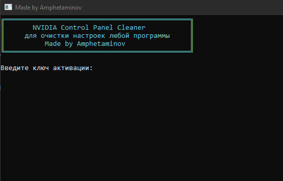

# 🎮 NVIDIA Control Panel Cleaner

<div align="center">
  
  <br>
  <b>Очистка настроек NVIDIA Control Panel для любой программы</b>
</div>

## ⚡ Возможности

- 🎯 Очистка настроек NVIDIA Control Panel для любой программы
- 🔍 Поиск записей в различных кодировках (UTF8, ASCII, Unicode)
- 🧹 Автоматическая очистка всех следов работы
- 🛡️ Безопасное удаление записей без создания бэкапов
- 🚀 Высокая скорость работы
- 🔐 Система активации для защиты

## 📥 Установка

1. Скачайте последнюю версию из [релизов](https://github.com/Amphetaminov/NvidiaCleaner/releases)
2. Запустите программу от имени администратора
3. Введите ключ активации: `amphetaminov`
4. Пользутейсь xD

## 🛠️ Использование

1. Запустите программу от имени администратора
2. Введите ключ активации
3. Укажите имя программы (например: osu!.exe, loader.exe)
4. Подтвердите удаление найденных записей
5. Дождитесь завершения очистки
6. Перезагрузите компьютер (не обязательно)

## ⚙️ Функции очистки

- Очистка файлов NVIDIA:
  - nvAppTimestamps
  - Driver.settings
  - GlobalPreferences.txt
  - ProfileDB.bin
  - Profiles.bin

- Очистка следов программы:
  - Журнал событий Windows
  - Recent Files
  - Prefetch файлы
  - Временные файлы
  - База данных Everything
  - LastActivityView
  - ShellBags
  - Записи реестра
  - USN журнал

## 🔑 Активация

Для активации программы используйте ключ:
```
amphetaminov
```

## ⚠️ Требования

- Windows 10/11
- NVIDIA Control Panel
- Права администратора
- .NET 8.0 (включен в программу)

## 🔒 Безопасность

- Программа не создает бэкапы файлов
- Очищает все следы своей работы (частично не все)
- Работает только с файлами NVIDIA
- Требует права администратора

## ⚖️ Отказ от ответственности

Используйте программу на свой страх и риск. Автор не несет ответственности за возможные проблемы.

## 📝 Лицензия

MIT License. Смотрите файл `LICENSE` для деталей.

---
<div align="center">
  <sub>Built with ❤️ by Amphetaminov</sub>
</div> 